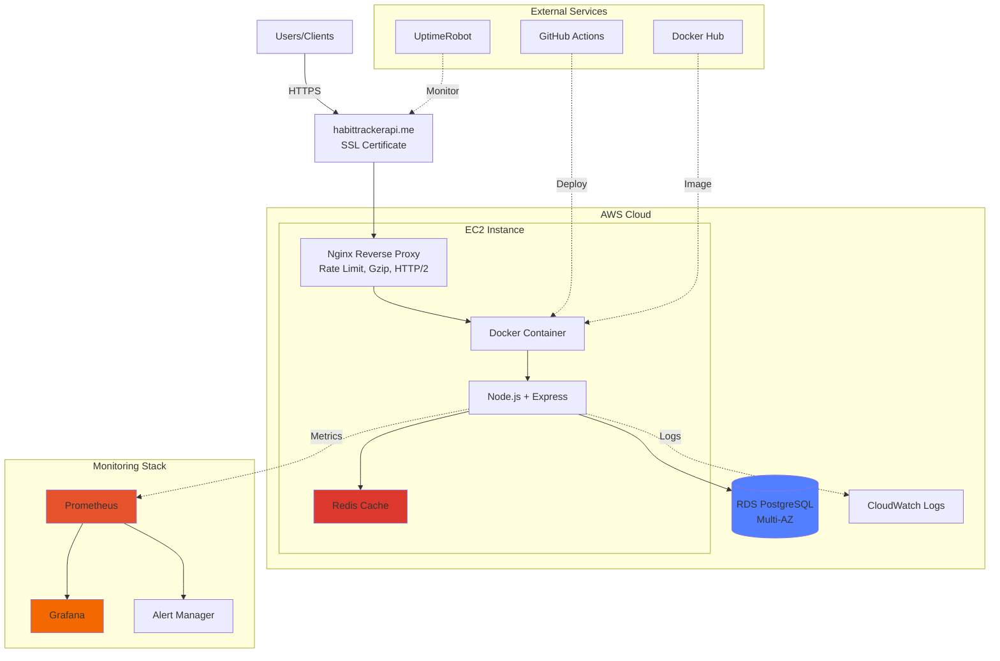

```mermaid
graph TB
    User[Users/Clients]
    Domain[habittrackerapi.me<br/>SSL Certificate]
    
    subgraph "AWS Cloud"
        subgraph "EC2 Instance"
            Nginx[Nginx Reverse Proxy<br/>Rate Limit, Gzip, HTTP/2]
            Docker[Docker Container]
            Node[Node.js + Express]
            Redis[Redis Cache]
        end
        
        RDS[(RDS PostgreSQL<br/>Multi-AZ)]
        CloudWatch[CloudWatch Logs]
    end
    
    subgraph "Monitoring Stack"
        Prometheus[Prometheus]
        Grafana[Grafana]
        AlertManager[Alert Manager]
    end
    
    subgraph "External Services"
        UptimeRobot[UptimeRobot]
        GitHub[GitHub Actions]
        DockerHub[Docker Hub]
    end
    
    User -->|HTTPS| Domain
    Domain --> Nginx
    Nginx --> Docker
    Docker --> Node
    Node --> Redis
    Node --> RDS
    Node -.->|Logs| CloudWatch
    Node -.->|Metrics| Prometheus
    Prometheus --> Grafana
    Prometheus --> AlertManager
    UptimeRobot -.->|Monitor| Domain
    GitHub -.->|Deploy| Docker
    DockerHub -.->|Image| Docker
    
    style RDS fill:#527FFF
    style Redis fill:#DC382D
    style Prometheus fill:#E6522C
    style Grafana fill:#F46800
```